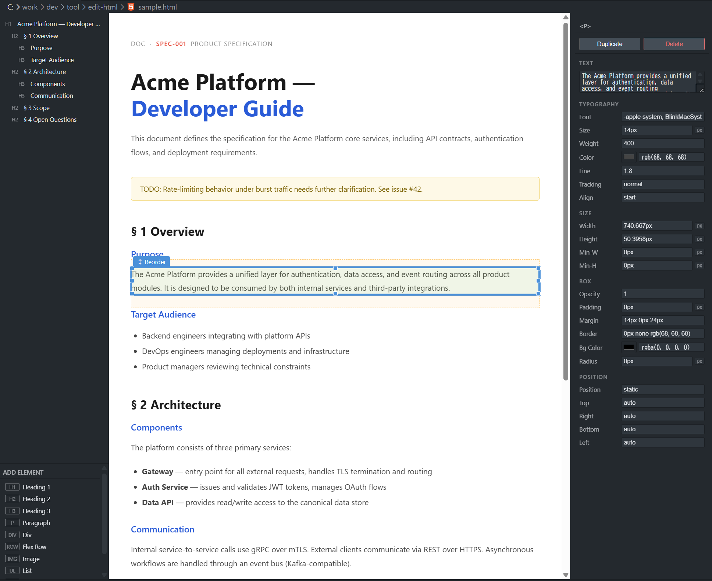

# HTML Document Editor



A VS Code extension for visually editing static HTML documents directly in the preview.
Designed for single-file HTML documents that use inline styles — spec sheets, reports, design mockups, and similar artifacts.

> This extension is intentionally scoped to HTML documents. It is not intended for HTML templates, component-based frameworks (React, Vue, Svelte), or CSS-class-driven stacks like Tailwind.

## Features

- Click any element in the live preview to select it
- Hover highlight shows which element will be selected before you click
- Right panel inspector — edit typography, size, box model, and position properties
- Color picker with hex input for color properties
- Scrub numeric values by dragging the property label left/right (Figma-style)
- Click unit badges (`px` / `rem` / `%`) to cycle units without converting values
- Resize elements visually with 8-direction handles
- Drag-and-drop reorder with sibling and container (`inside`) drop support
- Left panel — heading outline (h1–h6) for document navigation
- Add panel — insert common elements (headings, paragraphs, divs, flex rows, images, lists, etc.)
- Minimal-diff write-back: only the changed attribute or text range is replaced in the source, preserving comments, whitespace, and formatting
- Keyboard shortcuts: `Ctrl+S` save, `Ctrl+Z` undo, `Ctrl+Y` / `Ctrl+Shift+Z` redo

## Requirements

- VS Code 1.74 or later
- Node.js (for building from source)

## Getting Started

Install dependencies and build:

```
npm install
npm run build
```

Then open this folder in VS Code and press `F5` to launch an Extension Development Host.

To open a file with the editor:

1. Open any `.html` file in VS Code
2. Click the "Select application to open file" button in the editor title bar
3. Choose "HTML Document Editor"

For development with watch mode:

```
npm run watch
```
